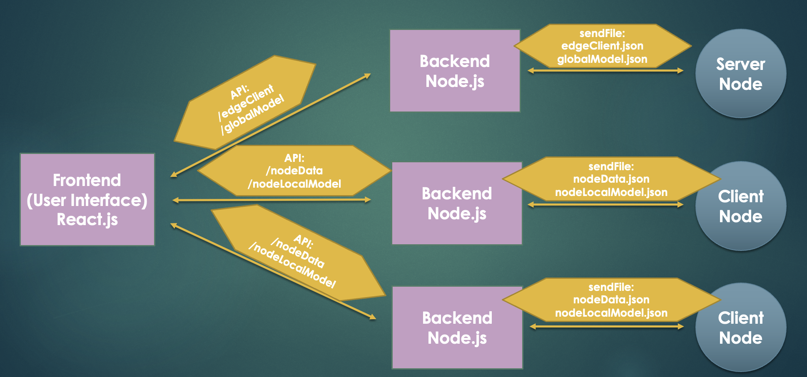
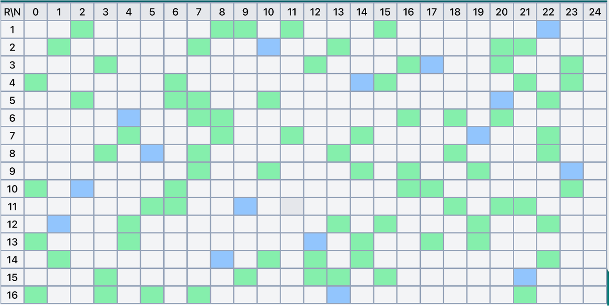
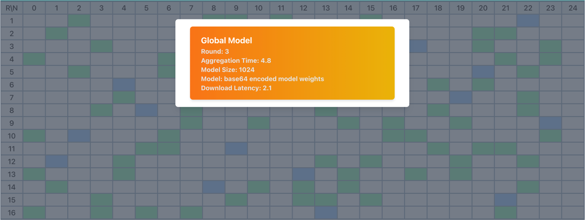
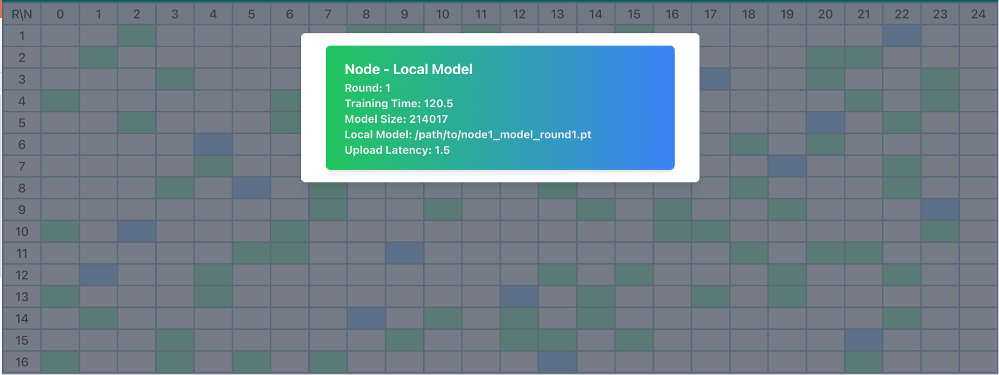

# Federated Learning X-Ray Application Dashboard

This project is a federated learning application for X-ray analysis. It leverages the GRING-App-Face_Exp_recog repository (https://github.com/git-disl/GRING-App-Face_Exp_recog) for data processing and classification. The frontend is built using React.js, and the backend is implemented in Node.js to fetch data from the GRING-App-Face_Exp_recog repository.

# Objective

The main goal of this application is to visualize the selection of peer nodes in each round of federated learning. It provides a user-friendly interface for displaying the selected nodes, data distribution, and learning information for each round. The frontend is designed to automatically refresh when data is updated in the backend. Additionally, clicking on a table cell will display the corresponding data, regardless of whether it originates from the server or the client.

# Technologies Used

React.js: A JavaScript library for building user interfaces.
Node.js: A JavaScript runtime for server-side development.
GRING-App-Face_Exp_recog: A repository used for face expression recognition in X-ray images.

# Project Structure

The project is designed following a full-stack architecture, leveraging React.js for the frontend and Node.js for the backend. The codebase is organized hierarchically, ensuring modularity and reusability. The UI is split into different components, with some components designed to be reusable across different parts of the application. This modular design facilitates code maintenance, debugging, and future enhancements.

# User Interface

Show selected nodes in each round

Show Global Model from Each round

Show Local Model in selected nodes from Each round
When click the colored cell, Frontend will show the local model information of corresponding node round in cell

# Functionality

The application consists of the following key features:

Visualization of Selected Nodes: The frontend presents a visual representation of the nodes selected for federated learning in each round. This information helps users understand the distribution of tasks and the participation of individual nodes.

Data Distribution: The application provides graphical representations and statistical information about the distribution of data across the participating nodes. This visualization aids in understanding the data availability and balance during the federated learning process.

Learning Information: Users can access relevant learning information for each round, including metrics, performance indicators, and other relevant data. This feature enables users to evaluate the progress and effectiveness of the federated learning algorithm.

Real-Time Data Updates: The frontend automatically refreshes whenever new data is available in the backend. This ensures that the user interface always reflects the most recent information, providing an up-to-date view of the federated learning process.

Interactive Data Exploration: Clicking on a table cell triggers the display of corresponding data. This feature allows users to explore specific data points in detail, enhancing the understanding and analysis of the federated learning results.
